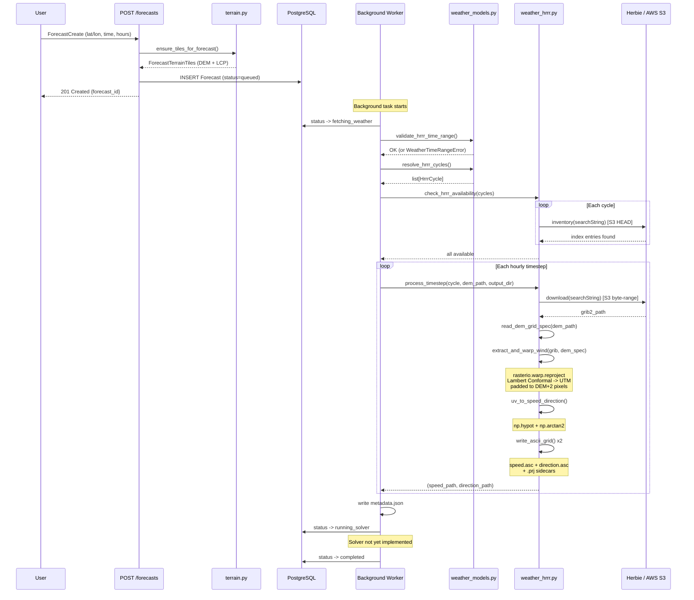

# Phase 2: Backend API Design Report

**Date:** May 15, 2026
**Status:** In progress -- terrain, weather, and solver pipelines implemented and reviewed; output file serving endpoints and end-to-end integration still pending

## Objective

Design and build a FastAPI backend that accepts user parameters and automates the terrain fetching, weather download, and WindNinja solver pipeline -- replacing the CLI-based workflow validated in Phase 1 with HTTP API endpoints.

## Scope Assumptions

- **US locations only.** Both primary data sources (USGS 3DEP for elevation, LANDFIRE for land cover) are US-only. International support (SRTM/GMTED) may be added later but is not a Phase 2 design priority.
- **Single-user, local execution.** No authentication, no multi-tenancy. The solver runs in a local Docker container invoked via subprocess. Cloud execution is deferred to Phase 4.
- **HRRR weather model only.** NBM is accepted as a parameter but the weather service implementation focuses on HRRR via AWS S3.

## Key Design Decisions

### 1. Hybrid UX: ephemeral "click and run" + saved locations

Users can initiate a forecast in two ways:

- **Ephemeral:** Click a point on the map, set parameters, run. No saving required. The system finds or downloads terrain, runs the solver, and shows results.
- **Saved:** Optionally save a location as a named ForecastArea (e.g., "Berthoud Pass") for quick reuse, historical comparison, or scheduled recurring forecasts.

This led to the Forecast table storing location parameters (center_latitude, center_longitude, size_km) directly, with an optional foreign key to ForecastArea. Every forecast knows where it was, regardless of whether a saved area exists.

### 2. Separate elevation and land cover caching

DEM (elevation) and LCP (land cover) data are cached in independent tables rather than as columns on a single "domain" row. The reasons:

| Property | DEM (Elevation) | LCP (Land Cover) |
|----------|----------------|-------------------|
| Source | USGS 3DEP | LANDFIRE |
| Format | GeoTIFF, 1 band | LCP, 8 bands (elevation + vegetation + fuel) |
| CRS | UTM (we choose at download) | LANDFIRE native Albers (~EPSG:5070, we don't control) |
| Resolution | 10m | ~30m |
| Update frequency | Almost never | Occasionally (fires, logging, development) |
| Coverage | US (3DEP), global (SRTM) | US only |

Independent tables allow re-downloading land cover after e.g a wildfire without touching the stable elevation data. Each forecast records which specific tiles it used, providing full traceability -- if land cover is updated, new forecasts use the new tile while old forecasts still reference the original.

### 3. Bounding box spatial caching with 25% padding

Terrain tiles are cached by a **WGS84** axis-aligned bounding box stored on each tile row (north, east, south, west in decimal degrees). That stored box is taken **from the downloaded file** (via GDAL / rasterio after write) so the index reflects **actual on-disk extent**.

**Lookup vs download.** The user's true request is a square from **center + ``size_km``** (the **user bbox**). Before fetching, we **pad** that square (default **25%** on each half-span) to form a **download bbox** that is sent to USGS / LANDFIRE. Padding exists so **substantially similar** later requests (slightly different center or size) still fall inside data we already pulled.

**Cache queries use the user bbox, not the padded bbox.** A hit is any tile whose **stored** (file-derived) bbox **fully contains** the **user** box for the current forecast. If we queried with the padded box, we would require the cache to match a **larger** region than the user actually asked for, which would **defeat** the purpose of padding (fewer hits, wrong semantics). Padding only enlarges the **fetch**; the **question** to the cache is always "do we already have real pixels covering **this user's** box?"

**Tile selection.** Among hits, **elevation** picks the **smallest** containing tile (tightest fit). **Land cover** picks the **most recently downloaded** among tiles that contain the user box, so newer LANDFIRE data is preferred when several tiles qualify.

This padding strategy is sufficient for Phase 2 and can be revisited if needed.

### 4. Convention-based output paths

Forecast output directories are derived from the forecast UUID (`data/output/{forecast_id}/`) rather than stored in the database. This avoids path bookkeeping and ensures every forecast has a predictable, unique output location.

### 5. Native backend development, Dockerized Postgres

The FastAPI backend runs natively on the Mac (Python 3.12 via pyenv) for fast iteration. Only Postgres runs in Docker via `docker-compose.yml`. This avoids container restart delays during development while keeping the database reproducible.

## Architectural Tradeoffs Considered

### Terrain table structure

Three options were evaluated:

1. **Combined row** -- DEM path + LCP path as columns on a single domain table. Simple but couples data with different update cadences, loses history on re-download, and conflates two different CRS values in one row.
2. **Separate tables** (chosen) -- `elevation_tiles` and `land_cover_tiles`. Independent lifecycle, clear semantics, full traceability per forecast. Minor duplication in table definitions.
3. **Generic tile table with type column** -- Single table, differentiated by a `type` discriminator. Flexible but adds filtering complexity to every query and nullable columns that only apply to one type.

Option 2 was chosen for clarity and independent lifecycle management.

### "Domain" naming and necessity

The original plan centered on a "Domain" concept (borrowed from WindNinja CLI terminology). Through design review, this evolved:

- "Domain" was renamed to "ForecastArea" for user-facing clarity.
- ForecastArea was made optional (nullable FK on Forecast) to support ephemeral forecasts.
- Location parameters were added directly to Forecast so every forecast is self-describing.

### Tile resolution storage

Resolution columns (`resolution_m`) were initially included on tile tables but removed after analysis showed: (a) resolution is fixed by the data source (10m for 3DEP, ~30m for LANDFIRE), (b) WindNinja reads resolution from the file metadata directly, and (c) no current logic branches on resolution. Comments document the omission rationale for future reference.

### Solver job execution model

Three options were evaluated:

1. **Synchronous** -- API blocks until solver completes. Simple but locks the HTTP connection for 30-60+ seconds.
2. **Background task with status table** (chosen) -- API returns immediately with a forecast ID. A background worker updates status in Postgres. Frontend polls for progress. Swappable to cloud job queue in Phase 4.
3. **Real task queue** (Redis/Celery) -- Production-grade but massive overkill for Phase 2 single-user local execution.

Option 2 provides the right API shape (submit, poll, retrieve) without infrastructure overhead.

## Data Model

Four tables, implemented in `backend/models/orm.py`:

```
ForecastArea (optional saved location)
  id, label, center_latitude, center_longitude, size_km, created_at

ElevationTile (cached DEM files)
  id, bbox_north/south/east/west [indexed], crs_epsg, file_path, source,
  downloaded_at, file_size_bytes (bigint)

LandCoverTile (cached LCP files)
  id, bbox_north/south/east/west [indexed], crs_epsg, file_path, source,
  downloaded_at, file_size_bytes (bigint)

Forecast (a single wind forecast job)
  id, forecast_area_id (nullable FK -> SET NULL) [indexed],
  center_latitude, center_longitude, size_km,
  elevation_tile_id (FK -> RESTRICT), land_cover_tile_id (nullable FK -> RESTRICT),
  status (enum) [indexed], weather_model (enum), solver_type (enum), output_wind_height,
  forecast_start, duration_hours,
  error_message, created_at [indexed], started_at, completed_at, updated_at (auto)
```

Enums (defined in `backend/models/orm.py`, used by ORM defaults and Pydantic schemas):
- **ForecastStatus:** queued, fetching_weather, running_solver, completed, failed
- **WeatherModel:** hrrr, nbm
- **SolverType:** mass_conservation, momentum

Relationships:
- ForecastArea has many Forecasts (optional grouping; SET NULL on area deletion)
- ElevationTile is referenced by many Forecasts (RESTRICT deletion)
- LandCoverTile is referenced by many Forecasts (nullable for non-US; RESTRICT deletion)

Indexes:
- Tile bbox columns are individually indexed for bitmap AND scans on spatial containment queries
- `forecasts.status` for polling active/queued jobs
- `forecasts.forecast_area_id` for listing forecasts per saved area
- `forecasts.created_at` for listing recent forecasts

Tile cache selection strategy (implemented as classmethods on tile models). Both use **containment of the user's true WGS84 bbox** (not the padded download bbox):

- **ElevationTile:** smallest tile that fully contains the user bbox (tightest spatial fit).
- **LandCoverTile:** most recently downloaded tile that fully contains the user bbox (newest land cover when several tiles qualify).

Stale job detection:
- `updated_at` is auto-set on every row update via SQLAlchemy `onupdate`. A forecast stuck in `running_solver` with a stale `updated_at` indicates a dead background worker.

Naming convention:
- `latitude` / `longitude` for user-input single-point coordinates (API create schemas)
- `center_latitude` / `center_longitude` for area/domain center points (ORM, response schemas, ForecastArea)
- `bbox_north/south/east/west` for bounding boxes (tile tables)

File path convention:
- Tile `file_path` values are stored relative to `settings.data_dir` (e.g. `elevation/abc123.tif`). The service layer resolves them to absolute paths at read time.

Database initialization:
- `database.py` has zero side effects at import time. It defines `Base` and provides `build_engine()` / `build_session_factory()` factory functions. The engine is created lazily by `deps.py` (via `@lru_cache`) on first HTTP request. This allows tests to override the URL and Alembic to manage its own engine independently.

## API Endpoints (planned)

| Method | Path | Purpose |
|--------|------|---------|
| POST | /forecast-areas | Save a named location |
| GET | /forecast-areas | List saved locations |
| GET | /forecast-areas/{id} | Get a saved location |
| DELETE | /forecast-areas/{id} | Remove a saved location |
| POST | /forecasts | Submit a forecast (from saved area or ad-hoc lat/lon) |
| GET | /forecasts | List forecasts (filter by area, status) |
| GET | /forecasts/{id} | Get forecast status and metadata |
| GET | /forecasts/{id}/output | List output files |
| GET | /forecasts/{id}/output/{filename} | Download an output file |
| GET | /health | Health check |

## Data Flow (Phase 2)

```
User request (lat/lon, size_km, time, duration)
        |
        v
  Compute user bbox (square from center + size_km)
        |
        v
  Compute padded bbox (e.g. 25% buffer) for download only
        |
        +---> Query elevation_tiles: stored bbox contains **user** bbox?
        |       |-- Yes: reuse cached tile
        |       |-- No:  download using **padded** bbox, insert row (stored bbox from file)
        |
        +---> Query land_cover_tiles: stored bbox contains **user** bbox?
        |       |-- Yes: reuse cached tile
        |       |-- No:  download using **padded** bbox, insert row (stored bbox from file)
        |
        v
  Insert Forecast row (status: queued)
  Return forecast ID to user immediately
        |
        v
  [Background worker]
        |
        +---> Download HRRR GRIB2 from AWS S3 (status: fetching_weather)
        +---> Extract U/V wind, reproject to DEM CRS, write speed/dir grids
        +---> Generate WindNinja config
        +---> docker run WindNinja_cli (status: running_solver)
        +---> On success: status -> completed
        +---> On failure: status -> failed, store error_message
```

## Terrain service

### Design principles

These principles were established during terrain service development and should guide the rest of the backend:

- **Make invalid states unrepresentable.** Value objects validate at construction. ``Wgs84BoundingBox`` enforces ``north > south`` and ``east > west`` via ``__post_init__``; code that receives one can trust it without re-checking. Domain size is capped (50 km) to prevent runaway downloads before the request reaches any external API.

- **Single public surface, layered internals.** ``terrain.py`` is the only module other code imports. Source-specific download logic (USGS 3DEP, LANDFIRE LCP) and pure geometry live in sub-modules the public API calls but external code never touches.

- **Independent layer durability.** DEM and LCP are independent caches with independent transaction commits. If LCP fails after DEM succeeds, the DEM row and file survive so the next attempt retries only the failed layer.

- **Metadata reflects reality, not intent.** Stored bbox columns are populated from the file actually written to disk, not from the padded request that triggered the download. Cache queries answer "do we have pixels here?" not "did we ask for pixels here?"

- **No orphans on failure.** Every download path cleans up partial files if metadata extraction or ORM insertion fails. A committed tile row always has a valid file behind it.

- **Typed errors for each failure mode.** ``TerrainDemError``, ``TerrainLcpError``, and ``TerrainOutsideUsError`` let the API layer map failures to appropriate HTTP responses without inspecting messages.

### Key invariants

- A ``Wgs84BoundingBox`` always satisfies ``north > south`` and ``east > west``.
- Cache lookup uses the **user bbox**; padding only enlarges the **download**.
- A tile row is never committed without the corresponding file existing on disk.
- A ``Forecast`` row is never inserted until both tile IDs exist.
- The terrain service owns its own transaction commits; callers must not wrap terrain resolution and Forecast insertion in a single transaction.

### Implementation summary

The terrain layer turns a forecast location (center lat/lon + ``size_km``) into two on-disk assets plus database rows: a DEM (GeoTIFF) and land cover (LANDFIRE LCP with ``.prj`` sidecar).

**Orchestration.** ``ensure_tiles_for_forecast`` builds the user bbox, pads it (default 25%), validates the padded extent falls inside CONUS, and resolves each layer. The frozen ``ForecastTerrainTiles`` result carries both tiles plus user and padded bboxes for downstream callers (solver config, logging).

**Why DEM and LCP use different runtimes.** Elevation uses py3dep on the host (USGS 3DEP at 10 m, reprojected to UTM). Land cover uses WindNinja's ``fetch_dem`` inside the solver Docker image (LANDFIRE source), reusing the same image as solver runs so the host doesn't need to duplicate the LCP/GDAL toolchain.

**Cache eviction.** Tiles currently accumulate without bound. A disk-budget or age-based eviction strategy is deferred to Phase 4; ``file_size_bytes`` on tile rows supports future budget-based cleanup without filesystem scanning.

**Tests.** Fast unit tests cover geometry, orchestration, and partial-failure durability; DEM/LCP I/O is mocked. Optional integration tests (``RUN_TERRAIN_INTEGRATION=1``) hit live USGS for manual validation.

### Status

The terrain service is **complete and reviewed**. All design principles, invariants, cache semantics, error handling, and file cleanup paths are implemented and tested (44 unit tests passing). No known bugs or gaps remain for the Phase 2 scope.

## Weather service

### Design decisions

- **griddedInitialization over wxModelInitialization.** Phase 1 validation showed WindNinja's built-in NOMADS downloader is fragile (empty-body responses from the NOMADS filter CGI, silent failures). The app downloads HRRR GRIB2 from AWS S3 via Herbie, converts U/V to speed/direction ASCII grids, and feeds them to WindNinja via ``griddedInitialization``. This decouples weather download from solver execution, enabling independent retries and future GRIB caching.

- **rasterio + GDAL GRIB driver for GRIB2 reading.** No additional dependencies (cfgrib/eccodes) needed; rasterio's bundled GDAL 3.12 reads GRIB2 natively. Band identification uses ``GRIB_ELEMENT`` tags (``UGRD``/``VGRD``).

- **Per-timestep solver execution.** WindNinja's ``griddedInitialization`` accepts a single timestep per config file. A 12-hour forecast requires 12 solver invocations. Phase 4 will parallelize these; Phase 2 runs them sequentially.

- **No weather database table.** Weather grids are ephemeral per-forecast artifacts stored under ``data/weather/{forecast_id}/``. Raw GRIB2 files are cached by Herbie in ``~/data/hrrr/`` and reused across forecasts automatically.

### Design principles (carried forward from terrain service)

- **Three-stage validation.** Time-based heuristics catch impossible requests (before archive start, too far in future) without network calls. Herbie inventory probes (S3 HEAD) confirm each cycle exists before committing to downloads. WindNinja's own error handling is the final backstop.

- **Typed errors for each failure mode.** ``WeatherTimeRangeError`` (invalid time range, maps to HTTP 422) and ``WeatherDownloadError`` (S3/GRIB/conversion failure, maps to HTTP 502) let the API layer choose appropriate responses.

- **No orphans on failure.** If any timestep fails, the entire ``weather/{forecast_id}/`` directory is removed via ``shutil.rmtree``.

- **Single public surface, layered internals.** ``weather.py`` is the only module other code imports. ``weather_models.py`` (pure datetime logic) and ``weather_hrrr.py`` (GRIB I/O + conversion) are internal sub-modules.

### Key invariants

- Forcing grids are **DEM size + 2** pixels in each dimension (one extra pixel on each side), matching the reference ``forcing_from_grib.py`` alignment contract.
- Speed is in **m/s**, direction is **meteorological convention** (degrees clockwise from north, direction wind blows FROM).
- NODATA is **-9999** for both grids.
- ``.prj`` sidecars use ESRI WKT1 format.
- ``analysis_time + forecast_hour == valid_time`` for every ``HrrrCycle``.

### HRRR cycle resolution explained

HRRR (High-Resolution Rapid Refresh) is a weather model that NOAA runs every hour. Each run is called a "cycle" and is identified by the hour it was initialized (e.g., the 12 UTC cycle). Each cycle produces forecast data for a number of hours into the future. The cycle resolution framework figures out, for every hour the user wants wind data, which specific HRRR cycle and forecast hour to pull from.

**Key concepts.** Every HRRR data point has two times: the *analysis time* (when the model run started) and the *forecast hour* (how many hours ahead of the analysis the data represents). A forecast hour of 0 (``fxx=0``) is the analysis itself -- the model's best estimate of conditions at the time it was initialized. ``fxx=2`` means the model's prediction 2 hours after initialization.

HRRR cycles have different forecast horizons. Standard cycles (most hours) produce forecasts up to 18 hours ahead. Extended cycles (00, 06, 12, and 18 UTC) produce forecasts up to 48 hours ahead. Data appears on AWS S3 roughly 1-2 hours after the cycle runs.

**How resolution works for past times.** For any timestep that has already happened, the resolver uses the analysis (``fxx=0``) from that hour's own cycle. This gives the best-available data because an analysis assimilates actual observations and is more accurate than any forecast.

**How resolution works for future times.** For timesteps that haven't happened yet, the resolver starts from the most recent cycle available on S3 and computes how many hours ahead the target time is. If that falls within the cycle's forecast horizon, it uses that cycle. If not, it walks backward through earlier cycles until it finds one with a long enough horizon.

**Worked examples.** All examples assume the current time is May 10, 2026, 14:00 UTC. The S3 publication lag is 2 hours, so the latest cycle available on S3 is 12:00 UTC.

**Example 1: 6-hour past window (pastcast).** User requests ``forecast_start=06:00, duration_hours=6``.

```
Timestep  Valid Time  Analysis  fxx  Reasoning
-------   ----------  --------  ---  ---------
0         06:00       06:00     0    Past: use 06:00 cycle analysis
1         07:00       07:00     0    Past: use 07:00 cycle analysis
2         08:00       08:00     0    Past: use 08:00 cycle analysis
3         09:00       09:00     0    Past: use 09:00 cycle analysis
4         10:00       10:00     0    Past: use 10:00 cycle analysis
5         11:00       11:00     0    Past: use 11:00 cycle analysis
```

Each hour uses its own cycle's analysis -- the most accurate data available for that hour.

**Example 2: 6-hour future window (forecast).** User requests ``forecast_start=16:00, duration_hours=6``.

```
Timestep  Valid Time  Analysis  fxx  Reasoning
-------   ----------  --------  ---  ---------
0         16:00       12:00     4    Future: latest cycle (12Z) + 4h
1         17:00       12:00     5    Future: latest cycle (12Z) + 5h
2         18:00       12:00     6    Future: latest cycle (12Z) + 6h
3         19:00       12:00     7    Future: latest cycle (12Z) + 7h
4         20:00       12:00     8    Future: latest cycle (12Z) + 8h
5         21:00       12:00     9    Future: latest cycle (12Z) + 9h
```

All timesteps use the 12 UTC cycle because it is the latest available and its 18-hour horizon covers the full window.

**Example 3: Mixed window (past + future).** User requests ``forecast_start=11:00, duration_hours=6``.

```
Timestep  Valid Time  Analysis  fxx  Reasoning
-------   ----------  --------  ---  ---------
0         11:00       11:00     0    Past: use 11:00 cycle analysis
1         12:00       12:00     0    Past/current: use 12:00 cycle analysis
2         13:00       12:00     1    Future: latest cycle (12Z) + 1h
3         14:00       12:00     2    Future: latest cycle (12Z) + 2h
4         15:00       12:00     3    Future: latest cycle (12Z) + 3h
5         16:00       12:00     4    Future: latest cycle (12Z) + 4h
```

The window spans the boundary between past and future. The first two hours use their own analyses; the rest use forecasts from the 12 UTC cycle.

**Example 4: Far-future fallback.** User requests ``forecast_start=08:00 May 11`` (tomorrow), ``duration_hours=3``. That is 18+ hours from now.

```
Timestep  Valid Time     Analysis  fxx  Reasoning
-------   ----------     --------  ---  ---------
0         May 11 08:00   12:00     20   12Z is extended (48h), 20h ahead
1         May 11 09:00   12:00     21   12Z is extended (48h), 21h ahead
2         May 11 10:00   12:00     22   12Z is extended (48h), 22h ahead
```

The standard 18-hour horizon of the 12 UTC cycle cannot reach May 11 08:00 (20 hours away). But 12 UTC is an extended cycle (one of 00/06/12/18) with a 48-hour horizon, so it can. If the latest cycle had been 13 UTC (standard, 18h max), the resolver would walk backward to 12 UTC to find the first cycle with enough range.

### Forecast pipeline call stack



### Implementation summary

The weather layer turns a forecast time window + DEM tile into per-timestep speed/direction ASCII grids ready for WindNinja ``griddedInitialization``.

**Cycle resolution.** ``resolve_hrrr_cycles`` maps each hourly timestep to an HRRR cycle. Past times use ``fxx=0`` (analysis) for each hour's own cycle. Future times use the latest available cycle with the appropriate forecast hour offset, falling back to extended cycles (00/06/12/18 UTC, 48h horizon) when standard 18h cycles can't reach the target time.

**GRIB processing pipeline.** For each timestep: Herbie downloads UGRD+VGRD at 10m above ground (byte-range S3 request, ~2-5 MB per timestep). rasterio reads the GRIB2, then ``rasterio.warp.reproject`` warps both bands from HRRR's native Lambert Conformal Conic to the DEM's UTM CRS at the padded extent. Numpy vectorized math converts U/V to speed/direction. The result is written as ESRI ASCII Grid with ``.prj`` sidecar.

**Pipeline wiring.** ``POST /forecasts`` resolves terrain synchronously (tiles may be cached), inserts the Forecast row, then launches a background task. The background worker transitions status through ``fetching_weather`` → ``running_solver`` → ``completed``/``failed``, each status update committed independently.

### Status

The weather service is **complete and reviewed**. All design principles, validation, GRIB processing, grid alignment, error handling, and cleanup paths are implemented and tested (51 unit tests passing). The forecast endpoint (``POST/GET /forecasts``) is implemented with terrain + weather + solver + background worker.

## Solver service

### Design decisions

- **DEM (.tif) as elevation file, not LCP.** Weather grids are aligned to the DEM's UTM CRS by the weather service. WindNinja's ``griddedInitialization`` requires forcing grids to match the elevation file's grid. Using DEM avoids a CRS rewarp step. The LCP tile is still recorded on the Forecast row for traceability. Per-pixel vegetation from LCP is replaced by a uniform ``vegetation`` parameter (default: ``trees``). TODO(Phase 4+): add LCP-aligned grid support for per-pixel vegetation.

- **One Docker container per timestep.** WindNinja's ``griddedInitialization`` accepts a single timestep per config file. A 12-hour forecast = 12 solver invocations. Docker startup overhead (~1-2s) is negligible vs. solver runtime (30-120s per timestep for momentum). This also gives clean error isolation per timestep.

- **Per-timestep retry with mesh cache cleanup.** The most common solver failure mode is OpenFOAM mesh corruption (AGENTS.md gotcha #1). On failure, the mesh cache is cleaned and the timestep is retried (default: 2 retries). If retries are exhausted, the entire output directory and mesh cache are cleaned up and the forecast is marked as failed.

- **Diurnal winds disabled.** For ``griddedInitialization``, hourly forcing grids already capture diurnal variation. Enabling ``diurnal_winds`` would double-count slope flow effects. The reference repo's ``generate_gridded_config`` also sets ``diurnal_winds = false``.

### Design principles (carried forward)

- **Single public surface, layered internals.** ``solver.py`` is the only module other code imports. ``solver_config.py`` (pure .cfg generation) and ``solver_runner.py`` (Docker subprocess) are internal sub-modules.

- **Typed errors for each failure mode.** ``SolverConfigError`` (invalid config inputs, maps to HTTP 502) and ``SolverExecutionError`` (Docker/WindNinja failure, maps to HTTP 502) let the API layer choose appropriate responses.

- **No orphans on failure.** On any exception, the output directory is removed and the mesh cache is cleaned. A completed forecast always has output files behind it.

- **Container paths vs host paths.** Config files use container paths (``/data/...``) because WindNinja runs inside Docker. The solver orchestrator maps between host and container paths using ``CONTAINER_DATA_ROOT = /data``, the same convention as ``terrain_lcp.py``.

### Key invariants

- All paths inside ``.cfg`` files are container paths, never host paths.
- The mesh cache is cleaned between retry attempts and on final failure.
- A ``Forecast`` row reaches ``completed`` only after all timesteps succeed.
- Output files go to ``data/output/{forecast_id}/`` (convention-based, not stored in DB).

### Implementation summary

The solver layer turns weather forcing grids + a DEM tile into WindNinja output (speed/direction rasters at 100m resolution, KMZ files).

**Config generation.** ``generate_windninja_config`` builds a single-timestep ``.cfg`` file using ``griddedInitialization``. All paths use container coordinates (``/data/...``). The config specifies ``momentum_flag = true`` for momentum solver (default) or ``false`` for mass conservation.

**Docker execution.** ``execute_windninja`` runs ``WindNinja_cli`` inside the solver Docker image via ``subprocess``. The host ``data/`` directory is mounted read-write at ``/data``. OpenFOAM's bashrc is sourced with error suppression per AGENTS.md gotcha #4.

**Retry and cleanup.** Each timestep is retried up to ``solver_max_retries`` times (default: 2) with mesh cache cleanup between attempts. On exhausted retries, ``run_solver_for_forecast`` removes the output directory and mesh cache, then re-raises.

**Pipeline wiring.** The background worker in ``_run_forecast_pipeline`` calls ``run_solver_for_forecast`` after weather grids are prepared. Status transitions through ``fetching_weather`` → ``running_solver`` → ``completed``/``failed``.

### Status

The solver service is **complete and reviewed**. Config generation, Docker execution, retry logic, mesh cache cleanup, and failure handling are implemented and tested (49 solver unit tests, 156 total passing). The full forecast pipeline (terrain → weather → solver) is wired end-to-end in the background worker.

## Import Conventions

Within a package, use relative imports (`from .database import Base`). Between packages, use absolute imports from the project root (`from models.database import build_engine`). Enforced via `.cursor/rules/import-conventions.mdc`.

## App Startup

The FastAPI lifespan handler creates the data directory structure on first startup:
`data/{elevation, land_cover, output, weather}/`. The `data/` directory is git-ignored and convention-based -- the path is controlled by `settings.data_dir`.

## Files Implemented

| File | Purpose |
|------|---------|
| `backend/config.py` | App settings via pydantic-settings (DB URL, data dir, solver image, LCP timeout, CORS origins) |
| `backend/models/database.py` | Declarative Base, engine/session factory builders (zero import side effects) |
| `backend/models/enums.py` | ForecastStatus, WeatherModel, SolverType enums (no heavy imports) |
| `backend/models/orm.py` | ORM models, tile cache selection classmethods |
| `backend/models/schemas.py` | Pydantic request/response schemas with UUID validation |
| `backend/api/main.py` | FastAPI app with lifespan, configurable CORS, router registration |
| `backend/api/deps.py` | FastAPI dependencies: lazy DB engine (@lru_cache), session, settings |
| `backend/api/routers/forecast_areas.py` | ForecastArea CRUD endpoints |
| `backend/api/routers/forecasts.py` | POST/GET /forecasts with terrain resolution, background worker, weather + solver pipeline |
| `backend/services/terrain_geometry.py` | Pure WGS84 bbox, square construction, fractional padding, CONUS validation |
| `backend/services/terrain_dem.py` | USGS 3DEP DEM download via py3dep, UTM reprojection |
| `backend/services/terrain_lcp.py` | LANDFIRE LCP via Docker ``fetch_dem``, ``.prj`` sidecar generation |
| `backend/services/terrain.py` | Public terrain API: cache lookup, metadata extraction, orchestration |
| `backend/services/weather_models.py` | HRRR cycle resolution, time-range validation heuristics (pure datetime) |
| `backend/services/weather_hrrr.py` | HRRR GRIB2 download via Herbie, rasterio extraction, U/V-to-speed/dir, ASCII grid writing |
| `backend/services/weather.py` | Public weather API: validation, orchestration, metadata recording |
| `backend/services/solver_config.py` | WindNinja .cfg generation for griddedInitialization (pure logic) |
| `backend/services/solver_runner.py` | Docker subprocess execution, mesh cache cleanup |
| `backend/services/solver.py` | Public solver API: per-timestep orchestration, retry, cleanup |
| `backend/tests/test_terrain_*.py` | Terrain unit tests and optional integration (env-gated) |
| `backend/tests/test_weather_models.py` | HRRR cycle resolution and time validation tests (21 tests) |
| `backend/tests/test_weather_hrrr.py` | GRIB processing, U/V conversion, ASCII grid writing tests (21 tests) |
| `backend/tests/test_weather.py` | Weather orchestrator tests: happy path, NBM rejection, cleanup (9 tests) |
| `backend/tests/test_solver_config.py` | Config generation tests: output format, solver types, validation (23 tests) |
| `backend/tests/test_solver_runner.py` | Docker execution and mesh cache cleanup tests (14 tests) |
| `backend/tests/test_solver.py` | Solver orchestrator tests: happy path, retry, cleanup, ordering (12 tests) |
| `backend/requirements.txt` | Pinned dependencies for Docker layer caching (derived from pyproject.toml) |
| `backend/Dockerfile` | Python 3.12 image with GDAL, deps-first layer caching |
| `docker-compose.yml` | Postgres-only (backend runs natively) |
| `.env.example` | Environment variable documentation |
| `.cursor/rules/import-conventions.mdc` | Import convention rule (relative within, absolute across) |
| `.cursor/rules/variable-naming.mdc` | Readable variable naming rule |

## Remaining Work

- Implement output file serving endpoints (``GET /forecasts/{id}/output``)
- End-to-end integration test: create forecast -> poll -> retrieve output
